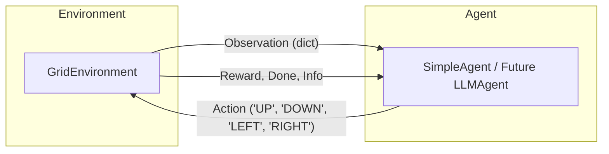

# LLM Robotics Simulation Workbench

An expandable, lightweight research workbench for exploring AI agents and Large Language Models (LLMs) applied to robotics simulation environments. 

This repository serves as a starter kit for undergraduate research, focusing on clean software engineering, modular components, and standard machine learning simulation API practices.

---

## 🏗️ Project Architecture

The workbench is organized using a clean **source-package layout**, separating core simulation modules, execution entry points, and test modules:

```text
llm-robotics-workbench/
├── src/
│   └── robotics_workbench/
│       ├── __init__.py        # Exposes public API modules
│       ├── environment.py     # 2D grid environment dynamics
│       ├── agent.py           # BaseAgent interface & simple heuristic agent
│       ├── simulation.py      # Simulation runner and execution loop
│       └── utils.py           # Console animation and status formatting
├── tests/
│   ├── __init__.py
│   ├── test_environment.py    # Unit tests for grid boundary / step rules
│   └── test_agent.py          # Unit tests for agent navigation decisions
├── run_simulation.py          # Entrypoint CLI script to run simulations
├── requirements.txt           # Python dependency file
└── README.md                  # Comprehensive workbench documentation
```

### Flow Diagram

The interaction loop follows the standard **Agent-Environment Interface** common in Reinforcement Learning and Robotics:



---

## ⚙️ Design Decisions

### 1. OpenAI Gym-Style API
To prepare for standard AI integrations, `GridEnvironment` implements an API similar to OpenAI Gym/Gymnasium:
- **`reset()`**: Re-initializes the environment and returns the initial state observation.
- **`step(action)`**: Processes the agent's action, updates coordinates, checks boundaries, and returns a tuple: `(observation, reward, done, info)`.

### 2. Observation Dictionary
Instead of raw coordinate arrays, the observation is returned as a structured dictionary:
```python
{
    "robot_position": (x, y),
    "target_position": (x, y),
    "grid_size": (width, height)
}
```
This structured format is highly descriptive, making it extremely easy to convert into text prompts for Large Language Models.

### 3. Modular Heuristic Baseline
By creating a `BaseAgent` class, we enforce a unified interface. The `SimpleAgent` uses coordinate differences to solve navigation deterministically. This serves as a baseline to compare future agents (e.g. LLM-based, RL-based).

---

## 🚀 Getting Started

### Prerequisites
- Python 3.7 or higher (only uses standard libraries; no external package dependencies are required to run the simulation).

### Installation
1. Clone this repository to your local system:
   ```bash
   git clone <your-repository-url>
   cd llm-robotics-workbench
   ```
2. (Optional) Install development dependencies (like `pytest` for alternative test runner configurations):
   ```bash
   pip install -r requirements.txt
   ```

### Running the Simulation
Execute the main script to watch the robot navigate the grid in real-time in your terminal:
```bash
python run_simulation.py
```

#### Customizing parameters via CLI:
- Run a larger grid (e.g., $15 \times 15$):
  ```bash
  python run_simulation.py --width 15 --height 15
  ```
- Run faster animation (e.g., 0.05-second frames):
  ```bash
  python run_simulation.py --delay 0.05
  ```
- Increase the maximum steps allowed:
  ```bash
  python run_simulation.py --max-steps 100
  ```
- Run headlessly (e.g. for batch experiments or speed testing):
  ```bash
  python run_simulation.py --no-render
  ```

### Running Unit Tests
Validate code behavior using Python's built-in `unittest` tool:
```bash
python -m unittest discover -s tests
```

---

## 🔮 Roadmap: Future LLM Integration

The modular design allows you to easily plug in LLMs. Here is a conceptual example of how you can create an `LLMAgent` by subclassing `BaseAgent`:

```python
from robotics_workbench.agent import BaseAgent
# import openai or your preferred LLM API client

class LLMAgent(BaseAgent):
    def __init__(self, model_name="gpt-4o"):
        self.model_name = model_name

    def select_action(self, observation) -> str:
        # 1. Format the observation dictionary into a text prompt
        prompt = f"""
        You are a robot controller. You are on a {observation['grid_size'][0]}x{observation['grid_size'][1]} grid.
        Your current position is {observation['robot_position']}.
        Your target goal is at {observation['target_position']}.
        
        Which action should you take next to reach the target?
        Select exactly one action from: [UP, DOWN, LEFT, RIGHT].
        Output ONLY the action word. Do not write explanation.
        """
        
        # 2. Call the LLM API
        # response = client.chat.completions.create(model=self.model_name, messages=[{"role": "user", "content": prompt}])
        # action = response.choices[0].message.content.strip().upper()
        
        # 3. Return the parsed action
        # return action
        return "UP" # Placeholder
```

---

## 📈 Recommended Git Commits

To maintain clean repository hygiene, split your initial setup into the following semantic commits:

1. `feat: initialize robotics simulation framework layout and configurations`
   - Files: `requirements.txt`
2. `feat: implement 2D Grid Environment with Gym-like step/reset API`
   - Files: `src/robotics_workbench/environment.py`
3. `feat: implement BaseAgent and rule-based SimpleAgent`
   - Files: `src/robotics_workbench/agent.py`
4. `feat: add SimulationRunner and utils for terminal animation dashboard`
   - Files: `src/robotics_workbench/simulation.py`, `src/robotics_workbench/utils.py`, `src/robotics_workbench/__init__.py`
5. `feat: add CLI runner script for executing grid simulations`
   - Files: `run_simulation.py`
6. `test: add unit test suite covering environment dynamics and agent navigation`
   - Files: `tests/__init__.py`, `tests/test_environment.py`, `tests/test_agent.py`
7. `docs: update README with architecture, design details, and LLM expansion plan`
   - Files: `README.md`
